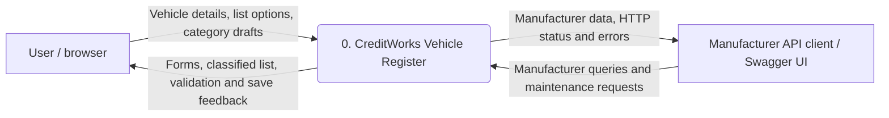
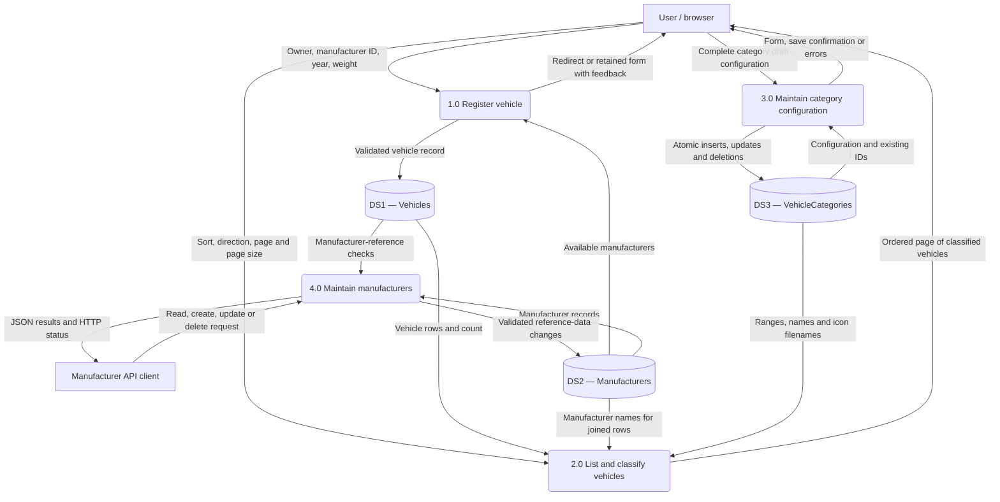
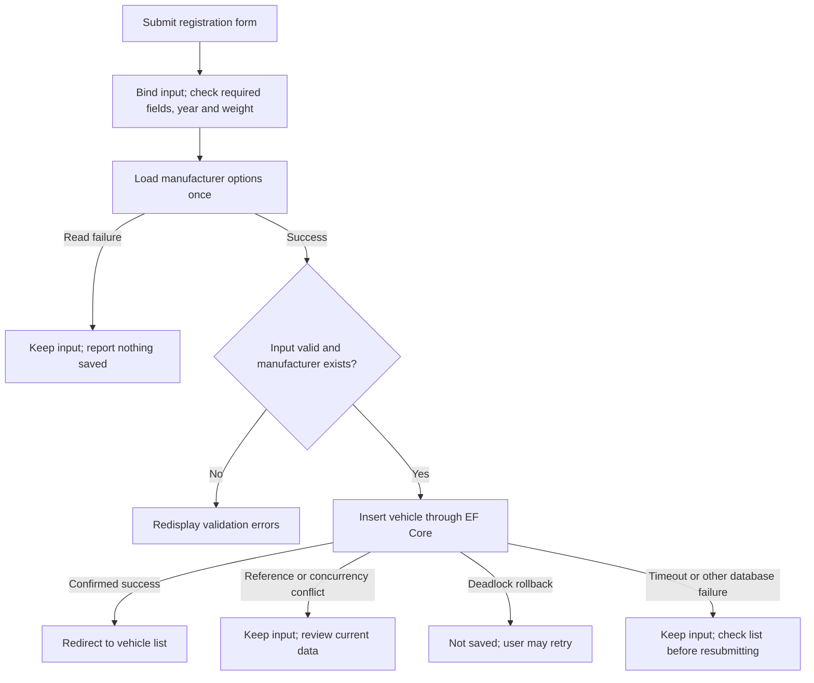
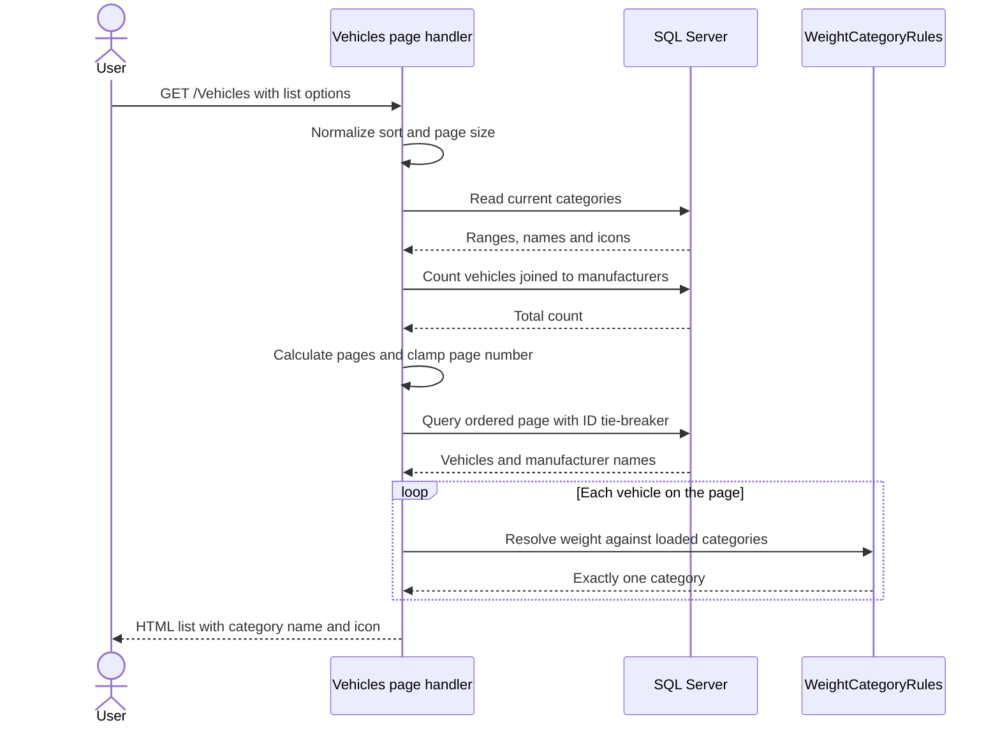
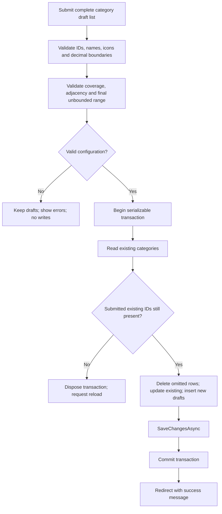

# CreditWorks Vehicle Register — Data Flow and Business Processes

**Document date:** 2 October 2026

**Related documents:** [System Design](SYSTEM_DESIGN.md) · [README](../README.md)

## 1. Purpose and notation

This document describes information movement through vehicle registration, listing, category administration and manufacturer maintenance in the implemented application.

Rectangles identify external participants, rounded rectangles identify processes, and cylinders represent SQL Server tables. The diagrams are editable Mermaid text. Processes describe parts of the existing application, not separate deployed services.

“User” and “API client” identify interaction channels, not security roles. No sign-in is currently required.

## 2. Context diagram



The system boundary includes the application and its persistence. The following diagram decomposes it into processes and stores.

## 3. Level 1 data-flow diagram



All stores are tables in one database. Users access them through application processes. Category administration writes DS3 only; it does not rewrite vehicles in DS1. A later list request reads the saved rules and derives the displayed category.

## 4. Data dictionary

| Flow / store | Contents | Key rule |
| --- | --- | --- |
| Vehicle submission | Owner, manufacturer ID, year, decimal weight | All required; weight positive and within precision/capacity |
| List options | Sort key, descending flag, page number and size | Fixed keys; sizes 5/20/50 |
| Category draft | ID, name, icon, minimum, optional maximum | Full proposed configuration |
| Classified row | Owner, manufacturer name, year, weight, category name/icon | Category derived from the request's loaded rules |
| Manufacturer input | JSON name for create/update; route ID for record operations | Trimmed name of 1–100 characters |
| DS1 — Vehicles | ID and four registration fields | Foreign key to DS2; no stored category ID |
| DS2 — Manufacturers | ID and unique name | Referenced records cannot be deleted |
| DS3 — VehicleCategories | ID, name, icon and weight boundaries | Coverage enforced by the application |

SVG files are static presentation assets, not uploaded records. SQL types are listed in [the database design](SYSTEM_DESIGN.md#3-database-and-indexing-design).

## 5. Vehicle registration



The form reuses manufacturer options loaded before saving. If the initial read fails, it retains the submitted ID with a temporary label, avoiding another database query to render the error response.

The server rejects zero/negative weight, more than two decimal places and values above `9999999999999999.99` kg even if browser validation is bypassed. Unrelated application exceptions reach the generic error page and server logs.

## 6. Listing, sorting and classification



Sorting precedes paging and applies to the full register. Text ordering follows SQL Server's collation. Every displayed row uses the same loaded category list.

For initial rules, 499.99 kg is Light, 500.00 kg is Medium and 2500.00 kg is Heavy. Resolution requires one match; zero or multiple matches raise an error.

The queries do not share a read transaction. Concurrent changes can occur between them; a subsequent request reads the newer rules. There is no background refresh or push channel for already-open tabs.

## 7. Category administration



Database failures can occur when beginning, reading, writing or committing. A transaction that has not committed rolls back on disposal. The page keeps drafts and maps recognized failures to safe messages. An uncertain outcome asks the user to inspect stored configuration before resubmitting.

Changing the Medium/Heavy boundary from 2500 kg to 2000 kg requires both adjacent ranges to change in one submission. Editing only one side produces a gap or overlap and is rejected.

```mermaid
sequenceDiagram
    actor User
    participant Categories as Category page / service
    participant SQL as SQL Server
    participant Vehicles as Vehicle list handler
    User->>Categories: Medium maximum = 2000; Heavy minimum = 2000
    Categories->>Categories: Validate full proposed configuration
    Categories->>SQL: Save in one transaction
    SQL-->>Categories: Commit confirmed
    Categories-->>User: Categories saved
    User->>Vehicles: Request vehicle list
    Vehicles->>SQL: Read rules and vehicle data
    SQL-->>Vehicles: Updated rules and existing 2200 kg vehicle
    Vehicles->>Vehicles: Resolve 2200 kg as Heavy
    Vehicles-->>User: Display Heavy name and icon
```

The vehicle's stored identity and weight remain unchanged. Other open lists display the new category after another request.

## 8. Manufacturer maintenance

Clients can list manufacturers, get a record by ID, create/rename a manufacturer and delete an unused one. Endpoints validate names and prevent duplicates. A deletion checks vehicle references, and the foreign key protects against a race between that check and the delete.

| Outcome | HTTP response |
| --- | --- |
| Successful read/update | 200 with JSON |
| Successful create | 201 with JSON and Location header |
| Successful delete | 204, no body |
| Invalid name | 400 validation problem |
| Missing record | 404 |
| Duplicate name or manufacturer in use | 409 with error message |

Unexpected API failures currently share the generic HTML error handler. See [interface details](SYSTEM_DESIGN.md#42-manufacturer-json-api) for routes and payload examples.

## 9. Failure and consistency considerations

### 9.1 Failed response versus failed save

A vehicle insert can commit before an error is received. The page therefore reports an unconfirmed result and asks the user to inspect the list. It does not automatically retry the insert. Integration tests simulate this case and verify that only one vehicle exists.

### 9.2 Transactions versus stale forms

A transaction prevents partial category saves. It does not establish whether a submitted form predates another user's edit. The application checks missing submitted IDs but has no configuration version, so an otherwise valid stale form can replace newer data or remove newly added rows.

### 9.3 Validation boundaries

Form handlers and API endpoints validate their inputs. Column types, foreign keys and the manufacturer-name unique index provide additional database protection. Direct SQL writes bypass application checks for positive weight, sensible years, category-name uniqueness and interval coverage.

### 9.4 Verification links

| Process | Automated evidence |
| --- | --- |
| Resolution and coverage | [WeightCategoryRulesTests](../tests/CreditWorks.Tests/WeightCategoryRulesTests.cs) |
| Category draft validation | [CategoryValidationTests](../tests/CreditWorks.Tests/CategoryValidationTests.cs) |
| Vehicle required fields | [VehicleInputTests](../tests/CreditWorks.Tests/VehicleInputTests.cs) |
| Registration, sorting, pagination | [VehiclePageTests](../tests/CreditWorks.Tests/Integration/VehiclePageTests.cs) |
| Transactions and reclassification | [CategoryPersistenceTests](../tests/CreditWorks.Tests/Integration/CategoryPersistenceTests.cs) |
| Failure messages and retained input | [SaveFailureMessagesTests](../tests/CreditWorks.Tests/SaveFailureMessagesTests.cs), [SaveFailureTests](../tests/CreditWorks.Tests/Integration/SaveFailureTests.cs) |

Tests cover page handlers and services. Full HTTP/browser behaviour, manufacturer API contracts and live deadlock scenarios remain future coverage.
