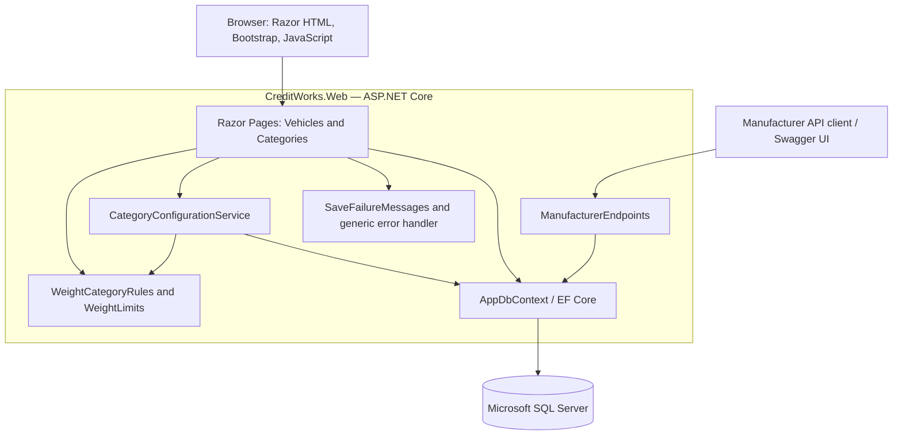
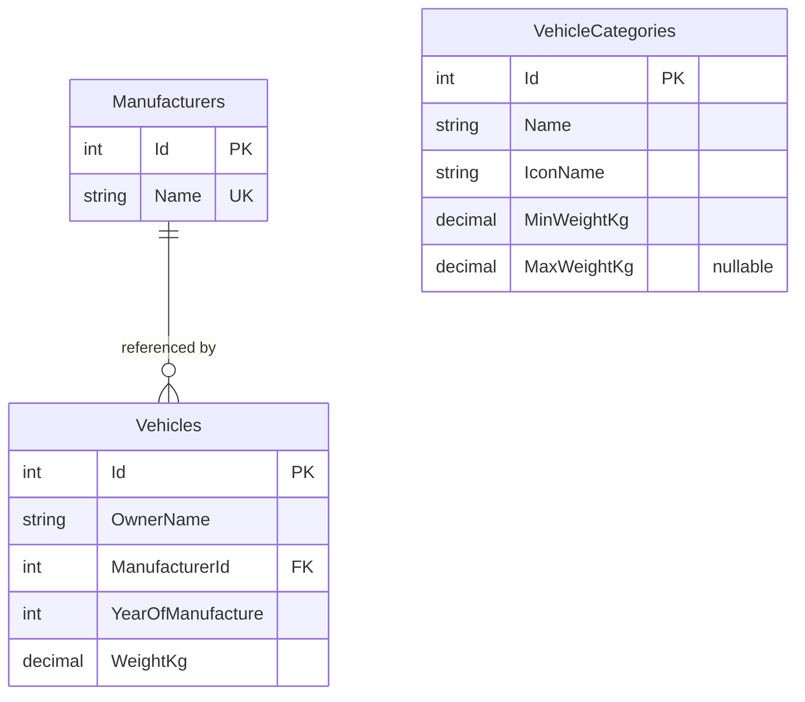

# CreditWorks Vehicle Register — System Design

**Document date:** 2 October 2026

**Status:** Current implementation and documented limitations

**Related documents:** [README](../README.md) · [Data Flow and Business Processes](DATA_FLOW.md)

## 1. Introduction

### 1.1 Purpose

This document explains the architecture, schema, interfaces, business rules, security considerations and verification approach for the CreditWorks programming assignment. It gives developers and reviewers a shared description of the implemented system.

### 1.2 Objectives and scope

The application records vehicle details and determines each vehicle's category from its weight. Users can browse and sort all vehicles, maintain category definitions and see existing vehicles classified using the current configuration.

The design targets a small, maintainable relational application. Its scope and technical choices follow the implemented assignment requirements. The companion data-flow document explains the same system through its processes and persistent stores.

| Capability | User outcome |
| --- | --- |
| Vehicle registration | Persist owner, manufacturer, manufacture year and weight |
| Vehicle list | Read vehicles with manufacturer and category name/icon |
| Sorting and pagination | Browse by owner, manufacturer, year or weight |
| Category administration | Create, edit and remove categories as one valid configuration |
| Dynamic classification | Use saved category rules when the list is loaded |
| Manufacturer API | Manage the reference data used by vehicles |

Rental reservations, payments, VIN/plate searches and customer-account management are outside scope. The implementation contains no microservices, API gateway, Redis, Elasticsearch, Kafka or MySQL.

## 2. Overall architecture

### 2.1 Structure

The solution contains one deployable ASP.NET Core web application and a separate test project. Simple queries use EF Core directly; transactional category changes use a dedicated service. Pure range rules are isolated in `WeightCategoryRules`.



Arrows show dependencies/request paths. Page responses are HTML. Successful manufacturer API responses and explicitly handled API errors use JSON.

### 2.2 Responsibilities

| Component | Responsibility | Source |
| --- | --- | --- |
| Vehicle pages | Registration validation; list queries, sorting, paging and classification | [Vehicle pages](../src/CreditWorks.Web/Pages/Vehicles) |
| Category page | Bind draft rows and display validation/save feedback | [Category handler](../src/CreditWorks.Web/Pages/Categories/Index.cshtml.cs) |
| Configuration service | Validate metadata and persist a complete configuration transactionally | [CategoryConfigurationService](../src/CreditWorks.Web/Services/CategoryConfigurationService.cs) |
| Range rules | Validate contiguous coverage and resolve exactly one category | [WeightCategoryRules](../src/CreditWorks.Web/Services/WeightCategoryRules.cs) |
| Persistence | Entity mappings, relationships and schema migrations | [AppDbContext](../src/CreditWorks.Web/Data/AppDbContext.cs), [migrations](../src/CreditWorks.Web/Migrations) |
| Initialization | Seed five manufacturers and three categories into empty tables | [DatabaseSeeder](../src/CreditWorks.Web/Data/DatabaseSeeder.cs) |
| Manufacturer endpoints | JSON CRUD with name validation and reference protection | [ManufacturerEndpoints](../src/CreditWorks.Web/Endpoints/ManufacturerEndpoints.cs) |
| Save-error presentation | Recognize database failures and produce safe messages | [SaveFailureMessages](../src/CreditWorks.Web/Services/SaveFailureMessages.cs) |

`AppDbContext` and `CategoryConfigurationService` are scoped services. Runtime database operations are asynchronous; read queries use `AsNoTracking`. Views and static assets are hosted by the same application.

### 2.3 Frontend behaviour

Enhanced navigation fetches server-rendered HTML and replaces the main content area. URLs remain directly accessible. Sorting and pagination execute on SQL Server. Forms use conventional POST submissions; confirmed saves redirect to a GET page.

The Add vehicle link uses a full page navigation so that the registration form's validation scripts initialize consistently. Category behaviour is loaded globally and initialized again after enhanced navigation.

Category JavaScript adds/removes draft rows, renumbers indexed form fields and previews icons. Draft changes remain in the browser until **Save all categories** is submitted. Server-side validation remains authoritative.

## 3. Database and indexing design

### 3.1 Relationships



Categories have no foreign-key relationship to vehicles. Membership is calculated from weight. SQL types and nullability follow below.

### 3.2 Vehicles

| Column | SQL Server type | Nullable | Definition |
| --- | --- | --- | --- |
| `Id` | `int` | No | Identity primary key |
| `OwnerName` | `nvarchar(150)` | No | Required name; application trims surrounding whitespace |
| `ManufacturerId` | `int` | No | Foreign key to `Manufacturers.Id` |
| `YearOfManufacture` | `int` | No | Application allows 1886 through the current UTC year |
| `WeightKg` | `decimal(18,2)` | No | Kilograms; application requires a positive value within storage capacity |

`ManufacturerId` is indexed, and referenced manufacturers cannot be deleted. There are no additional indexes on sortable fields or database check constraints for year/positive weight.

### 3.3 Manufacturers

| Column | SQL Server type | Nullable | Definition |
| --- | --- | --- | --- |
| `Id` | `int` | No | Identity primary key |
| `Name` | `nvarchar(100)` | No | Required name with a unique index |

Seed names: Mazda, Mercedes, Honda, Ferrari and Toyota. SQL name comparisons and uniqueness follow the database collation; the application does not set a custom collation.

### 3.4 VehicleCategories

| Column | SQL Server type | Nullable | Definition |
| --- | --- | --- | --- |
| `Id` | `int` | No | Identity primary key |
| `Name` | `nvarchar(100)` | No | Application enforces trimmed, case-insensitive uniqueness |
| `IconName` | `nvarchar(100)` | No | Allowed bundled SVG filename |
| `MinWeightKg` | `decimal(18,2)` | No | Inclusive lower boundary |
| `MaxWeightKg` | `decimal(18,2)` | Yes | Exclusive upper boundary; `NULL` means unbounded |

Allowed filenames are `light.svg`, `medium.svg` and `heavy.svg`, served from `wwwroot/images/categories/`. Category names and icon choices are independent; several categories may share an icon.

Range coverage, overlap prevention and category-name uniqueness are application rules, not database constraints. The three tables use generated identity IDs; other columns have no configured database defaults.

### 3.5 Initialization and consistency

EF migrations create the schema. The web project's `UseSeeding` callback initializes each reference table only when it is empty. Applying migrations is an explicit setup step; the web application does not migrate on startup.

A category save validates the proposed configuration, opens a serializable transaction, reads existing rows, deletes omitted IDs, updates submitted existing IDs and inserts drafts whose ID is zero. It commits after `SaveChangesAsync`. Disposal rolls back a transaction that has not committed.

This protects each save as a unit. It does not detect all edits made while someone has a form open. Stale submissions with still-valid IDs can replace newer work, as described in Section 8.

## 4. Interfaces

### 4.1 Razor Pages

| Method and route | Inputs | Successful result |
| --- | --- | --- |
| `GET /` | None | Home page |
| `GET /Vehicles` | `sort`, `desc`, `pageNumber`, `pageSize` | HTML register |
| `GET /Vehicles/Create` | None | Form with manufacturer options |
| `POST /Vehicles/Create` | `Input.OwnerName`, `Input.ManufacturerId`, `Input.YearOfManufacture`, `Input.WeightKg` | Redirect to list |
| `GET /Categories` | None | Configuration form |
| `POST /Categories` | Indexed `Categories[i]` fields | Redirect with success message |
| `GET /Error`, `POST /Error` | Error-handler re-execution context | Generic error page and request ID |

Index pages also accept `/Vehicles/Index` and `/Categories/Index`. Razor forms include antiforgery tokens. Invalid submissions and expected save failures redisplay HTML forms with validation messages rather than JSON responses.

| List parameter | Default | Behaviour |
| --- | --- | --- |
| `sort` | `owner` | `owner`, `manufacturer`, `year`, `weight`; unknown values use owner |
| `desc` | `false` | Ascending or descending |
| `pageNumber` | `1` | Bound integer clamped to available pages |
| `pageSize` | `20` | 5, 20 or 50; unsupported integer values use 20 |

Example: `/Vehicles?sort=weight&desc=true&pageNumber=2&pageSize=5`. All sorts use ascending vehicle ID as a tie-breaker. An empty register has zero results, page number one and one logical page.

Each category row submits `Id`, `Name`, `IconName`, `MinWeightKg` and `MaxWeightKg`. A blank maximum means null; a new row uses ID zero; omission of an existing ID requests deletion. The payload is the **entire intended configuration**. Example fields for one catch-all category:

```text
Categories[0].Id=0
Categories[0].Name=All vehicles
Categories[0].IconName=light.svg
Categories[0].MinWeightKg=0
Categories[0].MaxWeightKg=
```

Submitting this configuration replaces all existing categories. The illustration omits the antiforgery token and is not a standalone API request.

### 4.2 Manufacturer JSON API

Base path: `/api/manufacturers`. No authentication or bearer token is required in this implementation.

| Method | Path | Success | Expected errors |
| --- | --- | --- | --- |
| GET | `/api/manufacturers` | 200, array ordered by name | Unexpected errors use global handling |
| GET | `/api/manufacturers/{id}` | 200, object | 404 missing record |
| POST | `/api/manufacturers` | 201, object and Location header | 400 invalid name; 409 duplicate name |
| PUT | `/api/manufacturers/{id}` | 200, updated object | 400 invalid name; 404 missing record; 409 duplicate name |
| DELETE | `/api/manufacturers/{id}` | 204, no body | 404 missing record; 409 referenced manufacturer |

POST and PUT accept `Content-Type: application/json`:

```json
{"name": "Example Motors"}
```

Names are trimmed and must contain 1–100 characters. An illustrative creation response is:

```json
{"id": 6, "name": "Example Motors"}
```

IDs are generated, so the example ID is not guaranteed. The API uses HTTP status codes directly, without a `code/message/data` envelope. Invalid names return an ASP.NET validation-problem response. Duplicate names return:

```json
{"error": "A manufacturer with this name already exists."}
```

Deleting a referenced manufacturer returns:

```json
{"error": "This manufacturer is referenced by vehicles."}
```

Known conflicts and missing records have explicit responses. Other failures can reach the HTML error page, so the API does not yet have a uniform JSON error contract. Swagger UI and OpenAPI are enabled only in Development.

## 5. Business rules and error handling

### 5.1 Vehicle validation

All fields are required. Owner names have a 150-character limit. The manufacturer must exist when processing the form, and its foreign key also protects insertion. Year must be between 1886 and the current UTC year.

Weight must be positive, have at most two decimal places, and not exceed `9999999999999999.99` kg. `WeightLimits.MaximumKg` matches SQL Server `decimal(18,2)`. An invalid value is rejected rather than rounded into an acceptable one. HTML numeric constraints provide earlier feedback; the server repeats validation.

### 5.2 Category configuration

1. Require at least one category, valid IDs, names of up to 100 characters and an allowed icon.
2. Reject duplicate existing IDs and duplicate trimmed names, ignoring case.
3. Require finite boundaries to fit decimal precision/scale, with non-negative minima.
4. Sort proposed ranges by minimum; require the first minimum to be zero.
5. Require each finite maximum to exceed its own minimum and equal the next minimum.
6. Require an unbounded maximum only on the final category, which must be unbounded.
7. Verify submitted existing IDs, then persist all additions, edits and deletions together.

Invalid drafts are rejected before changes. Missing existing IDs produce a reload message. Deleting a category is valid only if the submitted remaining ranges still cover all valid weights.

### 5.3 Classification and read consistency

```text
weight >= MinWeightKg
AND (MaxWeightKg IS NULL OR weight < MaxWeightKg)
```

Exactly one category must match. Zero or multiple matches raise an error rather than silently choosing a category. Initial boundaries give Light below 500 kg, Medium from 500 to below 2500 kg, and Heavy from 2500 kg upward. Vehicle weights remain subject to their separate storage limit.

The list loads categories, counts joined vehicle/manufacturer rows, applies sorting and pagination, and resolves each displayed row in memory. All rows use the configuration loaded for that request. New requests reflect saved changes; other open tabs do not receive push updates.

Category read, row count and vehicle-page query are separate queries without one shared read transaction. Concurrent activity can affect a request's snapshot or pagination. The implementation does not guarantee a single transactionally consistent snapshot across them.

### 5.4 Save failures

| Failure | User-facing behaviour | Handling |
| --- | --- | --- |
| Invalid input/configuration | Specific field/range feedback | Redisplay inputs; no save |
| Missing submitted category ID | Reload and review changes | Service returns validation feedback |
| EF concurrency or SQL reference/unique conflict | Related data changed; review before retrying | Preserve input and log exception |
| SQL deadlock victim | Not saved; retry is appropriate | Recognize SQL Server's rollback outcome |
| Manufacturer read fails before vehicle save | Nothing saved; try later | Preserve input and submitted manufacturer selection |
| Database failure during a save attempt | Outcome unconfirmed; inspect current data first | Preserve input; no automatic retry |
| Unexpected exception | Generic error page with request ID | Global handling and server logs |

The helper recognizes EF wrappers around transient database exceptions. After a failed vehicle save, the form reuses previously loaded manufacturer options instead of querying the database again. Category failures retain the draft list.

Category database failures are conservatively described as unconfirmed because the page handler cannot determine exactly where the failure occurred. Exception details go to logs, not form messages. Cancellation and unrelated programming errors are not classified as expected database failures.

## 6. Non-functional and security design

### 6.1 Performance and availability

Database-side sorting and paging limit vehicle rows materialized per request. Read queries do not track entities. Each list request loads all categories and scans them for each displayed row, suitable for a small category set.

There is no cache, search index, replica routing, messaging, rate limiter or high-availability configuration. No QPS, latency or capacity benchmark has been established. Performance targets in the reference template are not measured results for this project.

### 6.2 Security and privacy

- EF queries are parameterized, and sorting uses an allowlist of fields.
- Razor encodes displayed text; icon filenames use a server-side allowlist.
- Razor forms use antiforgery validation. Manufacturer JSON endpoints have no explicit antiforgery validation or access-control policy.
- Local credentials use User Secrets; deployment can supply environment configuration. Secrets belong outside source control.
- HTTPS redirection and non-development HSTS are configured. Certificates/endpoints remain hosting concerns; the README documents local HTTP and optional HTTPS profiles.
- Authentication, authorization, owner-name masking and audit history are not implemented. Anyone with application access can read owners and change data through exposed operations.
- Generic pages avoid displaying stack traces or connection details. Operators should restrict access to server logs.

### 6.3 Operations

Schema changes use EF migrations. The application has no background jobs. Durability depends on SQL Server and its storage; local Docker uses a named volume. Backup/restore procedures, deployment automation, health checks and monitoring remain future operational work.

## 7. Verification strategy

Unit tests cover classification, invalid drafts, vehicle annotations and save-error classification. SQL Server integration tests use the actual schema and provider for registration, sorting, pagination, configuration changes, rollback and reclassification.

Failure tests simulate timeouts before reads, before saves and after vehicle writes. Another test deletes a manufacturer between validation and insertion to exercise a real foreign-key error. Tests check retained input, safe messages and logged exceptions. Rollback checks read through a fresh context.

Each integration run owns a uniquely named temporary database that is migrated and removed by the fixture. Integration tests are opt-in. The latest full verification on 2 October 2026 passed 93 tests with no failures or skips. See [test commands](../README.md#automated-tests).

The suite does not yet cover the complete HTTP/browser pipeline, manufacturer API contracts, all concurrent-editor scenarios or performance. Deadlock handling is implemented, but a real competing-transaction deadlock is not exercised by the current suite.

## 8. Assumptions, limitations and future work

| Decision / limitation | Rationale or implication | Possible extension |
| --- | --- | --- |
| One application | Keeps the assignment understandable and deployment simple | Separate components only when scaling/ownership justifies it |
| Separate manufacturer table | Allows reference changes without embedding names across code | Add an administration page if needed |
| Derived category membership | Existing vehicles use saved rules without bulk updates | Add rule history for historical classification |
| Complete configuration submission | Adjacent ranges change together without invalid intermediate states | Add a configuration version to reject stale edits |
| No optimistic concurrency token | A stale valid form can overwrite new edits or delete newly added rows | Add conflict detection and reload/merge workflow |
| Application-only interval rules | Keeps cross-row logic clear and testable | Restrict other write paths; assess database enforcement if external writers appear |
| Current UTC year | A documented, simple year boundary | Use a business timezone or configurable range if required |
| Weight ceiling equals storage capacity | Prevents overflow without inventing a business maximum | Agree a realistic domain limit with stakeholders |
| Three bundled icons | Meets icon assignment without an upload pipeline | Add reviewed assets or validated uploads |
| No identity or audit trail | Allowed for the assignment and local review | Add permissions and auditing before wider use |
| Offset paging and basic indexes | Adequate for a small register | Measure first; add indexes or keyset paging if needed |
| Unconfirmed saves require user review | Transport failure can follow a successful commit | Add creation idempotency keys and configuration versioning |
| Limited API contract | Main workflows use HTML pages | Standardize JSON errors and add API contract tests before external integration |

These extensions are proposals, not implemented features or service-level commitments.
